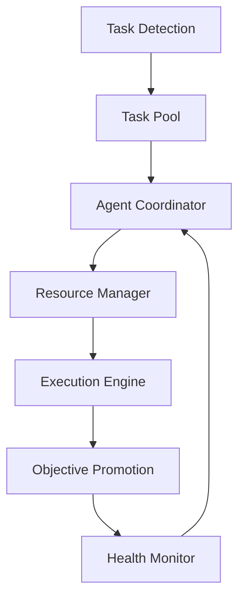

# AGENT[github_setup_agent]: Repository visibility has been set to public. Anyone can now access, clone, and contribute to the project.
# AGENT[documentation_agent]: Enhanced README with status badges, detailed usage examples, architecture diagram, and comprehensive documentation sections.
# AGENT[github_setup_agent]: Repository has been successfully made public on GitHub. The comment system is now integrated with version control.
# AGENT[test_agent]: This is a test comment showing how agents can dynamically add insights
# AI Agent Stack


[](https://codecov.io/gh/wowwaow/devstack)

A modular AI orchestration framework enabling scalable, fault-tolerant, and intelligent task execution across distributed systems. The AI Agent Stack revolutionizes multi-agent coordination through intelligent task detection, automatic objective promotion, and robust resource management.

## Overview
The AI Agent Stack is a sophisticated multi-agent system designed for coordinating AI operations with intelligent task detection and automatic objective promotion. This system provides a robust framework for managing AI agents, tasks, and resources in a distributed environment.

## System Architecture


## Key Features
- **Intelligent Task Detection & Management**
- **Automatic Objective Promotion**
- **Multi-Agent Coordination**
- **Real-time Monitoring & Health Checks**
- **Advanced Resource Management**
- **Robust Error Handling & Recovery**

## Repository Structure
```
agent_stack/
├── core/               # Core system components
│   ├── rules/         # System rules and governance
│   ├── objectives/    # Project objectives and tasks
│   ├── agent_status/  # Agent health and status tracking
│   ├── task_pool/     # Active and pending tasks
│   ├── dependencies/  # Task dependency management
│   ├── missing_tasks/ # Task detection system
│   └── promotion_queue/ # Objective promotion management
├── protocols/         # Agent coordination protocols
├── commands/          # System command definitions
├── docs/             # System documentation
└── logs/             # System and work logs
    ├── system_logs/  # Operational logs
    └── work_logs/    # Task execution logs
```

## Quick Start
```bash
# Clone the repository
git clone https://github.com/wowwaow/devstack.git
cd devstack

# Install dependencies
pip install -r requirements.txt

# Configure environment
cp .env.example .env
vim .env  # Edit configuration as needed

# Initialize and start the system
python initialize.py
python run_agents.py
```

## Usage Examples

### Starting Agent Manager
```python
from agent_stack import AgentManager

# Initialize with custom configuration
manager = AgentManager(
    num_agents=5,
    task_poll_interval=60,
    health_check_interval=300
)

# Start agent operations
manager.start()

# Submit a new task
task = manager.submit_task({
    'type': 'data_processing',
    'priority': 'high',
    'parameters': {'source': 'logs/system.log'}
})

# Monitor task status
status = manager.get_task_status(task.id)
print(f"Task {task.id} status: {status}")
```

### Using the CLI
```bash
# Start the agent system
devstack start --agents 5

# Monitor system status
devstack status

# View agent logs
devstack logs --agent-id ABC123
```

## Documentation
- [System Architecture](agent_stack/docs/SYSTEM_ARCHITECTURE.md)
- [Installation Guide](agent_stack/docs/INSTALLATION.md)
- [Usage Guide](agent_stack/docs/USAGE.md)
- [Command Reference](agent_stack/docs/COMMANDS.md)
- [Protocol Specifications](agent_stack/docs/PROTOCOLS.md)

## Requirements
- Python 3.8+
- Required Python packages (see requirements.txt)
- Sufficient system resources for multi-agent operations

## Advanced Features

### Intelligent Error Handling
- Automatic task retry with exponential backoff
- Failure isolation and containment
- Smart resource reallocation on failure

### System Recovery
- Checkpoint-based state recovery
- Transaction logging and replay
- Hot-swap agent replacement

### Monitoring & Analytics
- Real-time system dashboard
- Performance metrics and insights
- Predictive maintenance alerts

## CI/CD Pipeline

This project uses GitHub Actions for continuous integration and deployment:

- **Automated Testing**: Every PR triggers unit and integration tests
- **Code Quality**: Automatic linting and code coverage analysis
- **Security Scans**: Dependency and security vulnerability checks
- **Documentation**: Automatic documentation updates and deployment

View our [CI/CD workflows](.github/workflows) for details.

## Contributing

We welcome contributions! Please see our [Contributing Guidelines](CONTRIBUTING.md) for details on:

- Code Style and Standards
- Pull Request Process
- Issue Templates
- Development Setup
- Testing Requirements

### Getting Started with Development

1. Fork the repository
2. Create a feature branch
3. Make your changes
4. Run tests: `python -m pytest`
5. Submit a pull request

## License

This project is licensed under the MIT License - see the [LICENSE](LICENSE) file for details.

```
MIT License

Copyright (c) 2025 AI Agent Stack

Permission is hereby granted, free of charge, to any person obtaining a copy
of this software...
```

## Demo


_Above: AI agents coordinating to process a complex task pipeline_

For more demos and examples, visit our [demo gallery](docs/DEMOS.md).
